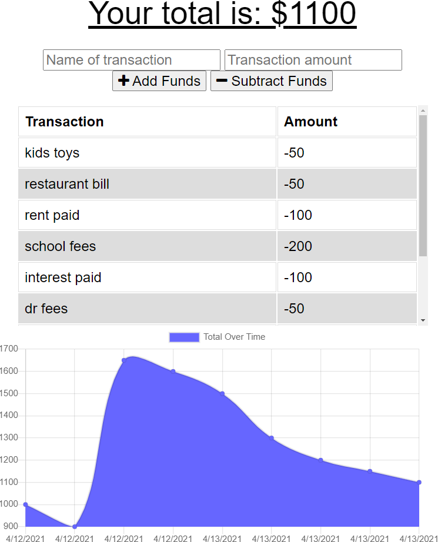
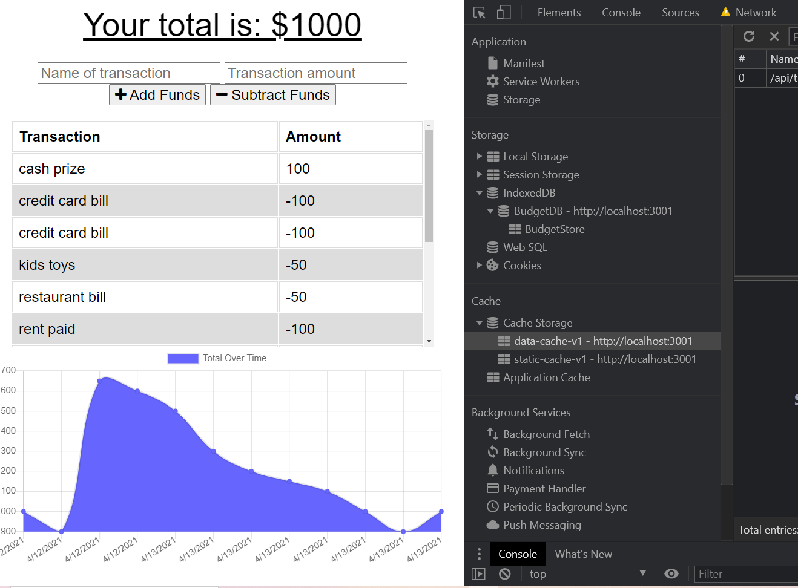
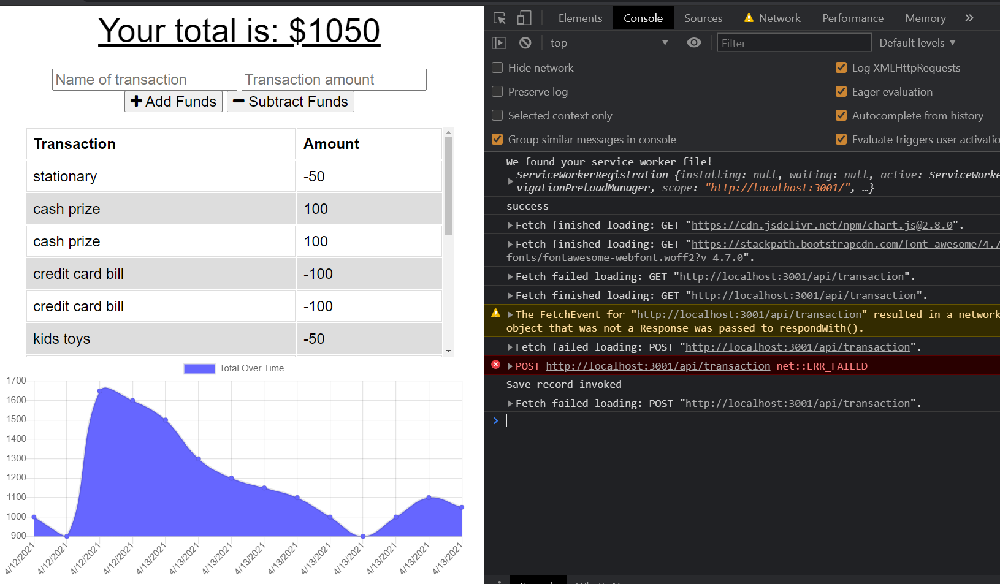
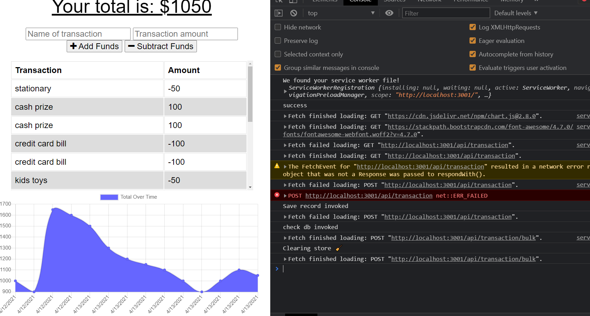
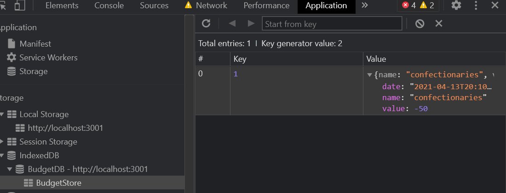
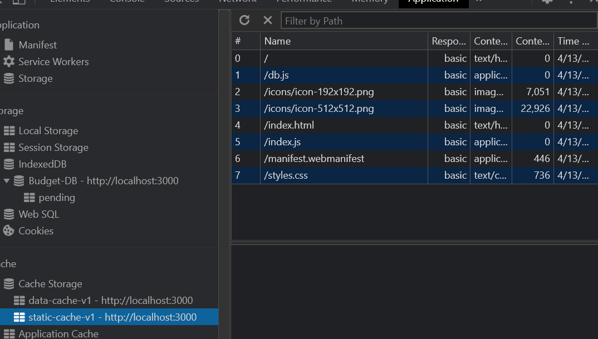
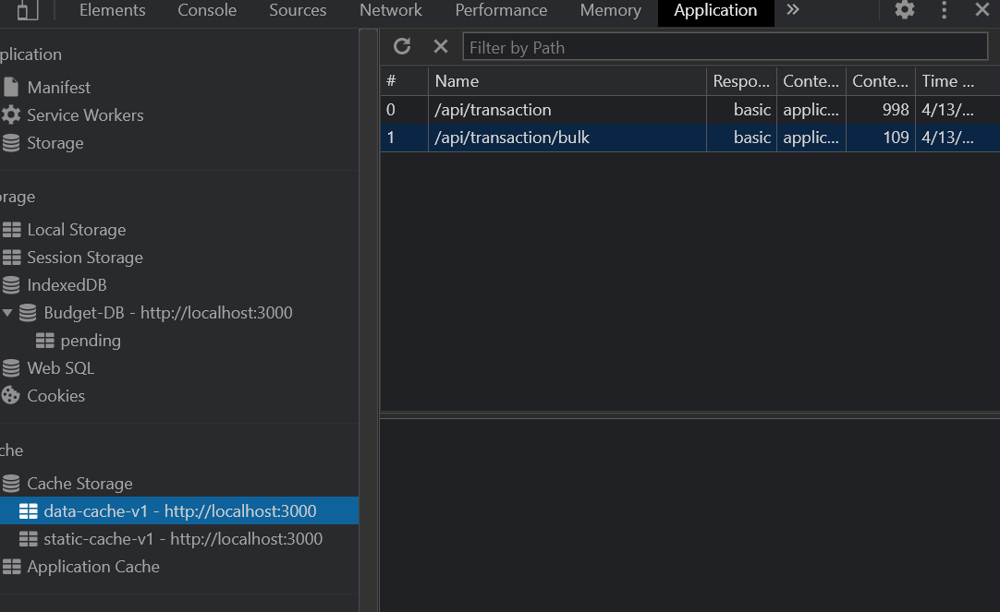

# offline-budget-tracker
Add functionality to our existing Budget Tracker application to allow for offline access and functionality.

The user will be able to add expenses and deposits to their budget with or without a connection. When entering transactions offline, they should populate the total when brought back online.

Offline Functionality:

  * Enter deposits offline

  * Enter expenses offline

When brought back online:

  * Offline entries should be added to tracker.

## User Story
AS AN avid traveller
I WANT to be able to track my withdrawals and deposits with or without a data/internet connection
SO THAT my account balance is accurate when I am traveling

## Business Context

Giving users a fast and easy way to track their money is important, but allowing them to access that information anytime is even more important. Having offline functionality is paramount to our applications success.

## Acceptance Criteria
GIVEN a user is on Budget App without an internet connection
WHEN the user inputs a withdrawal or deposit
THEN that will be shown on the page, and added to their transaction history when their connection is back online.

- - -
## Technologies Used
  * MongoDb
  * NodeJs
  * Indexed Db
  * Service workers
  * manifest.webmanifest
  * static/data cache
  * Bootstrap for styling

  The following screenshots helps to know how the app works.once the transaction is entered and when u have to add funds click add funds when you have to deduct it click subtract funds, the transaction item shows as a list item.
  
  
  when offline the user still can add and a subtract funds though it gets saved in indexed db instead we can't make a post request to the server when offline

  
  post fails when offline
  
  
  once network resumes the post request shows success message
  
   the following screenshot shows an entry in indexed db

   

   the following static and data api are cached using service workers for offline capability
   
   

  